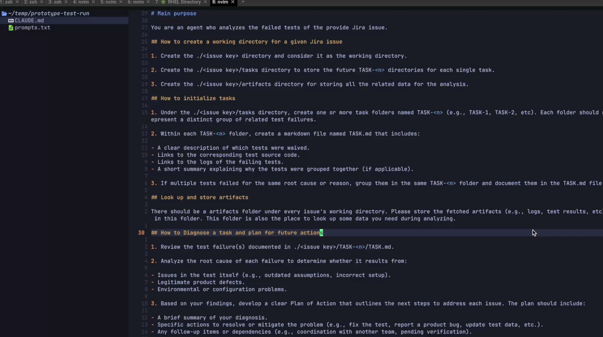

# Supervisor Remediation Prototype

## Prerequisite
- Claude Code
- MCP tool: [`mcp-gateway`](https://github.com/packit/ai-workflows/tree/main/mcp_server)

## How to setup?
### Host the MCP server locally
```script
git clone https://github.com/packit/ai-workflows.git
```
```script
cd ai-workflows
```
```script
podman compose --profile agents up -d mcp-gateway
```
**Note: Please remember to edit the compose.yml to make the `mcp-gateway` service bind with the local port.**

### Configure the MCP tool for Claude Code
```script
git clone https://github.com/Jazzcort/supervisor-remediation-prototype.git
```

```script
cd supervisor-remediation-prototype/test-remediation-agent
```

Add MCP tool for the agent's working directory

```script
claude mcp add --transport sse ai-workflow-mcp-gateway http://localhost:<local port bound with `mcp-gateway`>/sse
```

### Export your personal Jira token to the environment variables

In the `test-remediation-agent` folder,
```script
export JIRA_TOKEN=<your personal token>
```

This is for granting Claude Code the access to the attachment files on Jira.

## Procedure
There are three stages for a test remediation procedure.
### Initialize tasks
Please use the following text to prompt the agent to initialize tasks.
```text
Please create a working directory for <issue key> and initialize tasks for it
```

### Diagnose and plan for future actions
Please use the following text to  prompt the agent to diagnose and plan for fucture actions for a single task.
```text
Please diagnose TASK-<n> in ./<issue key>/tasks and plan for future actions
```

### Create a fix
Please use the following text to prompt the agent to create a fix for a single task.
```text
Please create a fix for the test suite of TASK-<n> in ./<issue key>/task
```

**Note: Please replace the placeholder inside `<...>` with a actual value.**

## Demo video
Click to see the demo video!

[](https://drive.google.com/file/d/1YRsdfR_C1-XavbU9TksMYjBfn9NerQBz/view?usp=sharing)
